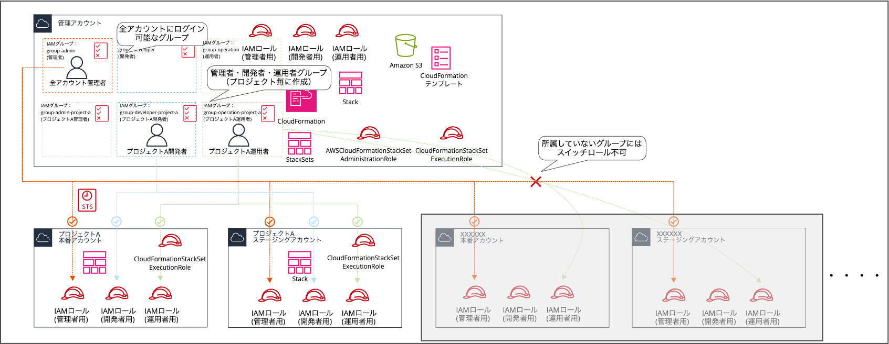

# AWS Jumpアカウント方式 マルチアカウント環境構築

AWS Organizationsを使用せずに、Jumpアカウント方式でマルチアカウント環境のIAM管理を実現するためのCloudFormationテンプレート集です。

## 概要

本リポジトリは、一つの管理用アカウント（Jumpアカウント）にIAMユーザーを集約し、スイッチロール機能を使用して各プロジェクトアカウントへアクセスする仕組みを構築するためのテンプレートとドキュメントを提供します。

# 構成図

### 主な特徴

- **一元管理**: すべてのIAMユーザーをJumpアカウントで管理
- **スケーラビリティ**: CloudFormation StackSetsによる複数アカウントへの一括デプロイ
- **セキュリティ**: MFA強制とスイッチロールによる権限制御
- **効率性**: 新規アカウント追加時の設定作業を最小化

## 各種ファイル

| ファイル名 | 説明 |
|-----------|-----|
| stackset-admin-role.yaml | StackSets管理ロール |
| stackset-execution-role.yaml | StackSets実行ロール |
| iam-global-groups.yaml | グローバルIAMグループ |
| iam-groups.yaml | プロジェクト固有IAMグループ |
| iam-roles.yaml | スイッチロール用IAMロール |

## 使い方

こちらのブログをご参考ください。

### 詳細な実装手順

実装の詳細手順については、以下のブログ記事をご参照ください。

**📝 [AWS Organizations不要：CloudFormation StackSetsを使って、マルチアカウント環境でJumpアカウント方式を実装してみた](https://dev.classmethod.jp/articles/multi-account-management-without-organizations/)**
